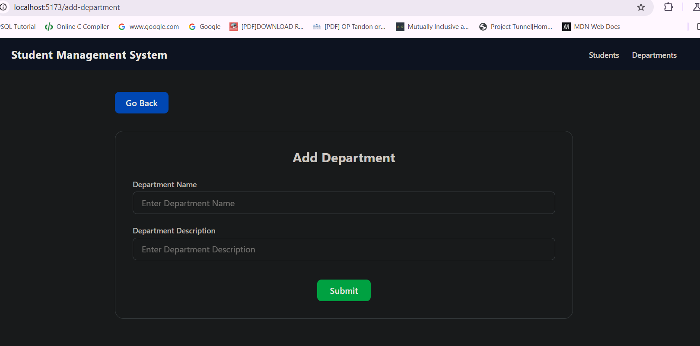
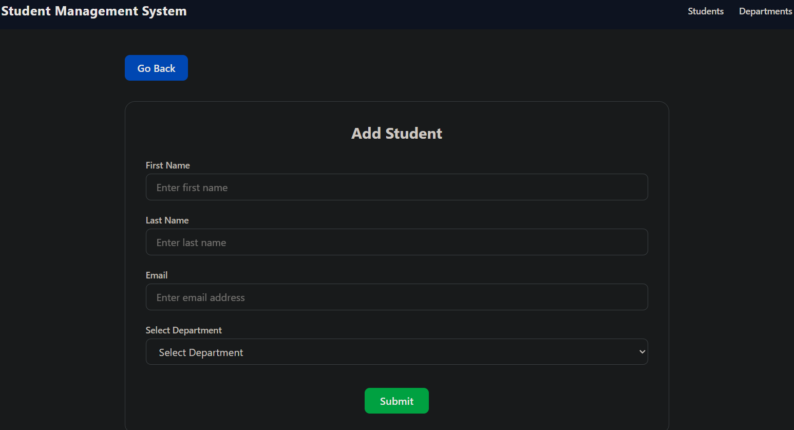
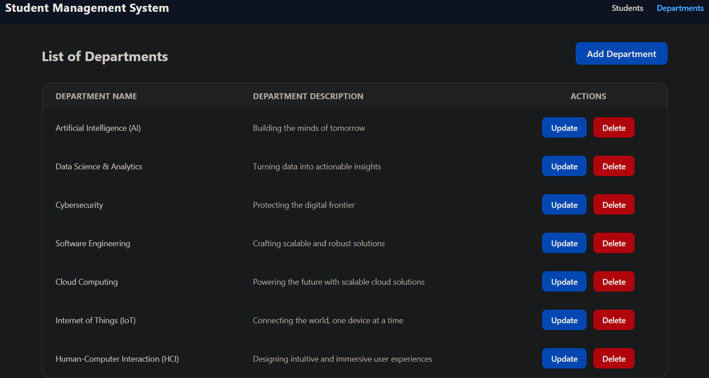
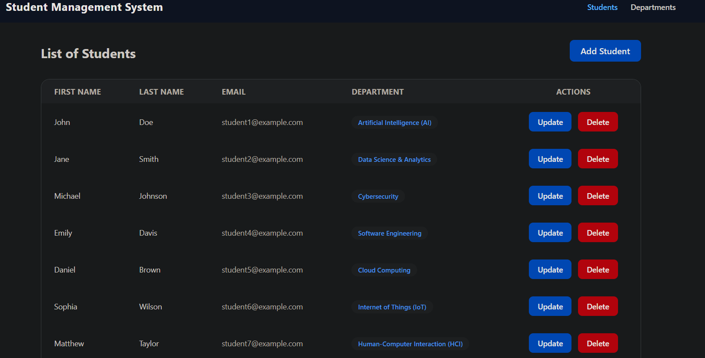

# Student Management System 📚

A Full-stack web application built using **React** and **Spring Boot** for managing student records efficiently. The Student Management System allows users to add, update, and delete student information, along with their respective departments. This system ensures seamless communication between the frontend and backend, providing a user-friendly interface to manage student details.

---

## Tech Stack 🖥

- **Client:** React, TailWind CSS, React Router, Axios, Toast Notifications Library  
- **Server:** Spring Boot, Spring JPA, Spring Web, MySQL  

---

## Key Features 🎇

- Add, update, and delete student records with first name, last name, email, and department.  
- View a list of students with associated department information.  
- Manage departments by adding and updating their names and descriptions.  
- Integration of React frontend for dynamic and responsive user interfaces.  
- Backend powered by Spring Boot providing RESTful APIs for data operations.  
- Axios used for asynchronous HTTP requests between frontend and backend.  
- React Router implemented for smooth client-side routing.  
- Toast notifications inform users about success and failure of their actions.  
- Use of custom React hooks for reusable logic across components.  

---

## Screenshots 🎞

  
  
  
  

---

## Instructions 🕶

### Prerequisites
- Java Development Kit (JDK) 8 or above  
- Node.js and npm (Node Package Manager)  
- MySQL database with a schema named `student_management_system`  

### Setup

1. **Clone the repository**  
   ```
   git clone https://github.com/shivammiyyy/Student_Management_System
   ```

2. **Setup MySQL database**  
   - Create a MySQL database named `student_management_system`.  
   - Update the database connection properties in the backend Spring Boot `application.properties` file:
     ```
     spring.datasource.url=jdbc:mysql://localhost:3306/student_management_system
     spring.datasource.username=your_db_username
     spring.datasource.password=your_db_password
     ```

3. **Build and run the Spring Boot backend**  
   - Navigate to the backend directory (e.g., `springboot-backend`):  
     ```
     cd springboot-backend
     ```
   - Build the project using Maven (Linux/macOS):  
     ```
     ./mvnw clean package
     ```  
     *or on Windows:*  
     ```
     mvnw.cmd clean package
     ```
   - Run the backend server:  
     ```
     ./mvnw spring-boot:run
     ```

4. **Install dependencies and run the React frontend**  
   - Open a new terminal window and navigate to the frontend directory (`react-frontend`):  
     ```
     cd react-frontend
     ```
   - Install dependencies:  
     ```
     npm install
     ```
   - Start the frontend development server:  
     ```
     npm start
     ```

5. **Access the application**  
   - Backend runs on default port `8080`.  
   - Frontend runs by default on port `3000` (or `5137` if customized).  
   - Open your web browser and go to:  
     http://localhost:5137
     

---

## Notes

- Ensure backend is running before interacting with the frontend to avoid API call failures.  
- The system uses REST APIs exposed by the Spring Boot backend for all student and department management.  
- Toast notifications pop up on frontend after create, update, delete actions to confirm success or show error messages.  

---

This Student Management System is a great starting point to build more complex education management applications with modern web technologies.

---

**Enjoy managing your student data with ease!**  
```

=
